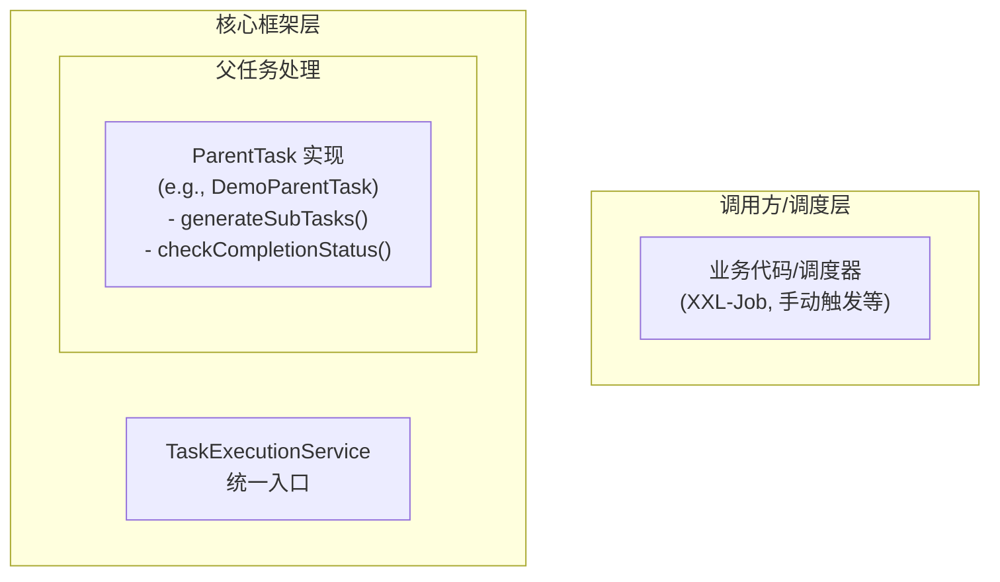

# 使用正确的mermaid语法

使用正确的mermaid语法创建图表代码，充分参考下面的Mermaid 语法特殊字符说明：

* Mermaid 的核心特殊字符主要用于**定义图表结构和关系**。
* 要在节点 ID 或标签中**显示**这些特殊字符或包含**空格**，最常用方法是用**双引号 `""`** 包裹。
* 在标签文本（引号内）中显示 HTML 特殊字符 (`<`, `>`, `&`) 或 `#` 等，应使用 **HTML 实体编码**。
* 要在标签内**换行**，使用 `<br>` 标签。如果使用`<br>`，则标签内使用引号包括，比如"ManualCall Domain/Infra<br>(Entity, Repo)"
* 节点名称中不要使用括号

* **必须规则 1**：所有的Mermaid图表必须要被以``` mermaid 开头代码块包裹
* **必须规则 2**：所有 MermaidJS 图表内的节点文字描述都必须加上双引号，例如：A ["二氧化碳 (CO2)"] --> B ["水 (H2O)"]
* **必须规则 3**：禁止使用任何样式代码（如 style、fill、stroke 等）来设置背景颜色或边框样式
* **必须规则 4**：不要写所有的注释
* **必须规则 5**：每个 `subgraph` 都要有对应的 `end`，属于不同模块的必须使用子图，模块内不同模块需要嵌套子图
* **必须规则 6**：边描述中的序号后，必须跟着转义符，比如：`1\.`，`2\.`
* **必须规则 7**：在 `graph TB` 中，不要使用 `<|--`，直接使用 `--`
* **正确示例**：`A["设备A"] --> B["交换机"]` 或 `A[["IP 地址 "逻辑地址""] --> B["局域网寻址 "同一网络段""]`
* **错误示例**：`A[设备A] --> B[交换机]` 或 `style A fill:#f9f,stroke:#333,stroke-width:2px`
* **正确示例**：`graph LR
    A -- "1\. 创建父任务请求" --> B
    B -- "2\. 创建 ParentTask 记录" --> I`
* **错误示例**: `graph LR
    A -- "1. 创建父任务请求" --> B
    B -- "2. 创建 ParentTask 记录" --> I`  
* **正确实例**：


